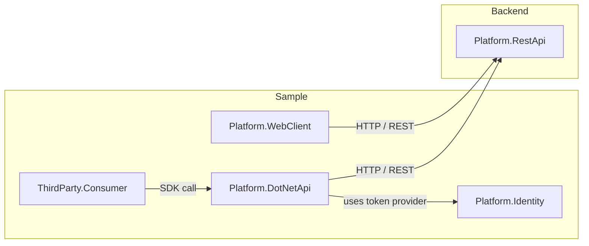

# DocuwareArchitect Sample

This repository is a simplified architecture sample inspired by DocuWare-style
integration platforms. It demonstrates a REST-first backend, an optional .NET
SDK wrapper, a platform-facing web client, a third-party consumer application,
and a small identity/token abstraction.

The goal is not to reproduce DocuWare. The project is a compact demonstration
of how a document platform can expose a core REST API while also offering a
typed .NET client library for applications that prefer SDK-style integration.

## Architecture Overview



> Note: this diagram describes the current sample implementation. The web
> client calls the REST API directly, while the `.NET API` remains an optional
> SDK wrapper for third-party .NET applications.

## Component Responsibilities

- **Platform.Identity**: simplified identity provider and token service. In a real product, this would be replaced with OAuth/OpenID Connect or a centralized token service.
- **Platform.RestApi**: core REST platform exposing document resources and platform APIs.
- **Platform.DotNetApi**: .NET SDK wrapper that encapsulates REST requests and exposes a developer-friendly client interface (`IDocuwareClient`).
- **Platform.WebClient**: MVC platform application that calls `Platform.RestApi` directly, similar to a browser-hosted product UI using platform endpoints.
- **ThirdParty.Consumer**: external consumer app simulating a third-party integration that references the SDK DLL and calls the platform through client methods.

## What This Demonstrates

- A core REST API as the main platform boundary.
- A typed .NET client library over the REST API.
- A first-party web client that calls REST endpoints directly.
- A third-party .NET consumer that calls the same REST platform through the SDK.
- Token-aware client setup through dependency injection and configuration.
- A Docker Compose setup for running the services together.
- A small document workflow slice: list documents, create documents, and consume them from another application.

## Design Principles

- **Separation of concerns**: backend service, SDK wrapper, platform UI, and third-party consumer are clearly separated.
- **REST-first integration**: the REST API is the core platform contract.
- **Optional SDK layer**: the `.NET API` provides a typed wrapper for .NET applications without replacing the REST API.
- **Product-style boundaries**: each project has a focused role and communicates through explicit contracts.
- **Pluggable identity concept**: identity is separated from platform operations, laying the groundwork for OAuth or token-based auth.

## Scope

This sample intentionally keeps the domain small. It currently models document
operations only. Areas such as metadata, tasks, roles, groups, annotations,
workflow activities, document validation, and collaboration are not implemented.

Authentication is also simplified. `Platform.Identity` provides a local token
concept used by the SDK path, but the REST API and web client do not yet enforce
a full authentication/authorization pipeline.

## Running the Sample

### Build all projects

```powershell
dotnet build
```

### Run with Docker Compose

```powershell
.\start-docker-with-swagger.ps1 -Build
```

This script builds and starts all services, then opens:

- REST API Swagger: `http://localhost:5000/swagger`
- WebClient UI: `http://localhost:5001`
- ThirdParty Consumer Swagger: `http://localhost:5002/swagger`

### Run projects individually

```powershell
dotnet run --project Platform.RestApi\Platform.RestApi.csproj
dotnet run --project Platform.WebClient\Platform.WebClient.csproj
dotnet run --project ThirdParty.Consumer\ThirdParty.Consumer.csproj
```

## Key Endpoints

- `GET /api/documents` - read documents
- `POST /api/documents` - create a document
- `GET /api/documents-from-factory` - demo of SDK usage in the third-party consumer

## Why this architecture sample exists

This sample is intended to show practical platform design ideas in a small codebase:

- a backend service with a clear HTTP boundary
- a reusable SDK abstraction layer
- a platform-facing UI sample
- a separate third-party integration surface
- a dedicated identity/token module

It is presented as a simplified product-like architecture, not a complete
document management system.
